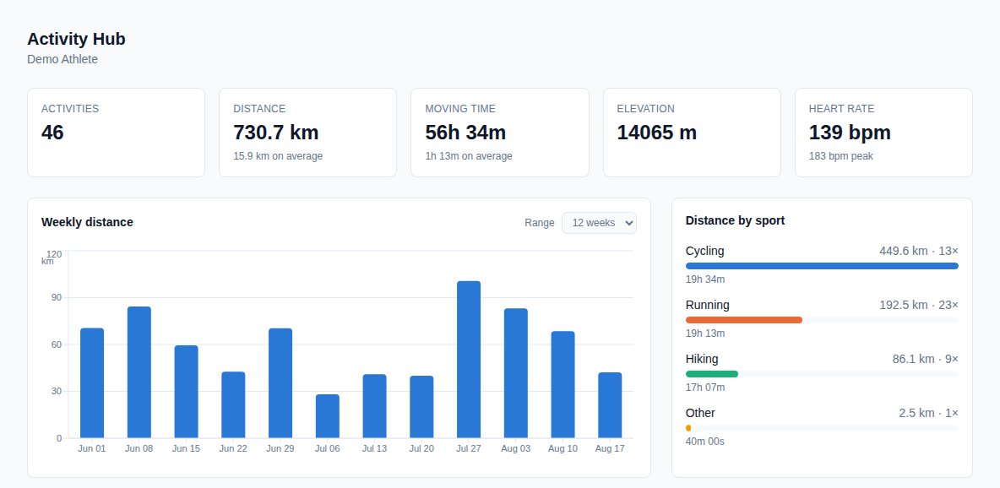
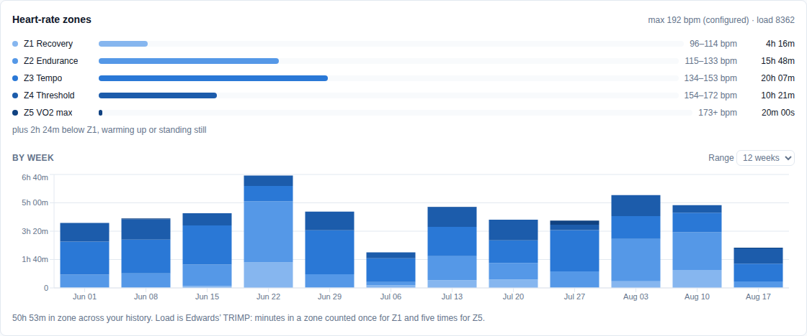
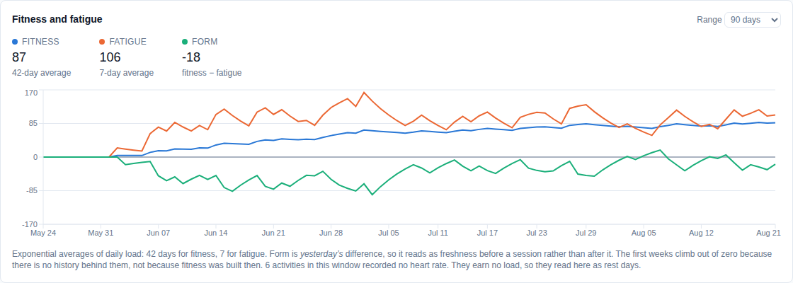
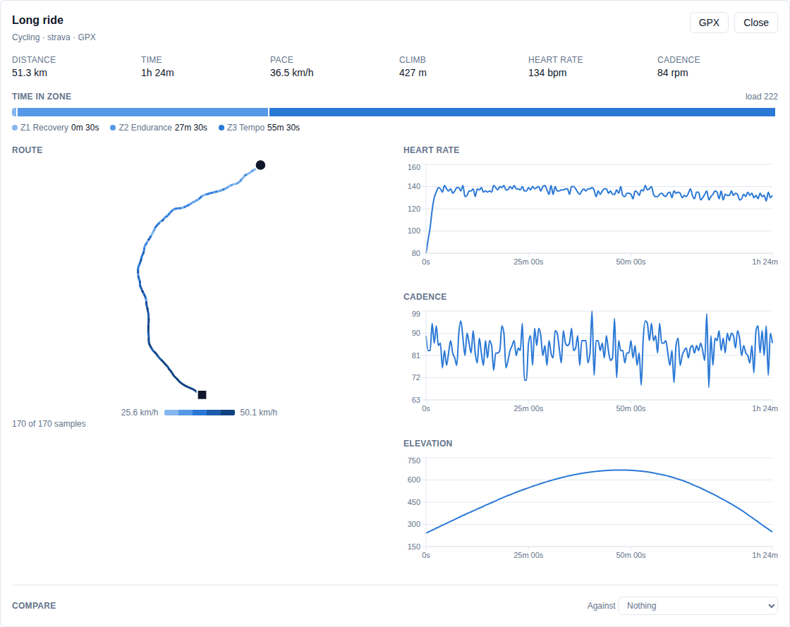
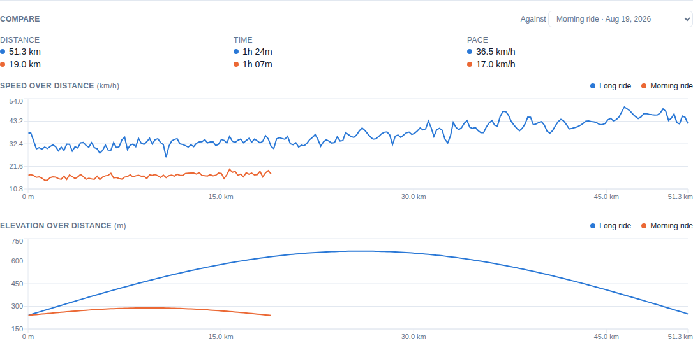
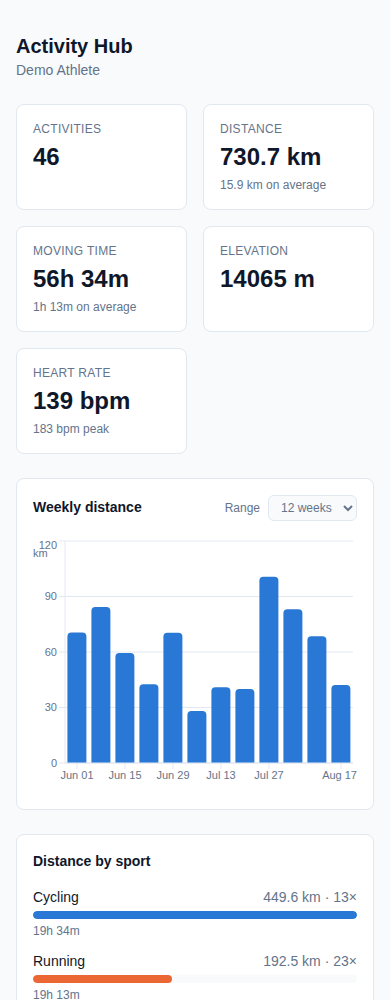
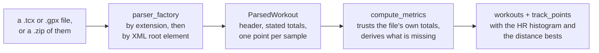

# Activity Hub

[](https://github.com/Danielededo/activity-hub/actions/workflows/ci.yml)

Self-hosted training log. Feed it the TCX and GPX files your watch or Strava
exports, and get your history back as numbers and charts that stay on your own
machine.

One user, no accounts, no external services, no telemetry. Units are metric
throughout.

<picture>
  <source media="(prefers-color-scheme: dark)" srcset="docs/images/dashboard-dark.png">
  
</picture>

## Quick start

You need **Docker with Compose v2**. Nothing else — the images build themselves.

```bash
git clone https://github.com/Danielededo/activity-hub.git
cd activity-hub
cp .env.example .env          # then change POSTGRES_PASSWORD
docker compose up --build     # first run takes a few minutes
```

Open <http://localhost:8080>. The dashboard asks for your name once, and that is
the whole of setup. Then feed it your activities: drop files on the upload box,
pick a folder, or hand it the entire `.zip` your watch or Strava exported.

To try it without your own data, load the bundled demo set:

```bash
./demo/load.sh                # 22 synthetic activities over five weeks
```

## What you get

- **Upload TCX and GPX** — one file, a folder, a drag and drop, or the whole
  export as a `.zip`. Garmin, Strava, Komoot and anything else that writes
  standard files. Re-uploading is safe: files already stored are skipped, and
  each file is reported separately as it lands.
- **Lifetime totals** — distance, moving time, elevation, heart rate, with
  per-sport breakdowns, and a weekly trend over 8 to 52 weeks.
- **Heart-rate zones and training load** — how much time goes into each of five
  zones, per activity and per week, with Edwards' TRIMP as the load figure.
- **Fitness, fatigue and form** — the 42-day and 7-day exponential averages of
  daily load, and the difference between them.
- **Personal bests** — the fastest 1 km, 5 km, 10 km, half marathon and
  marathon you have ever covered, per sport, each naming the activity that set
  it. Plus the furthest, longest and biggest-climbing activity of each sport,
  and totals by year.
- **Every activity in a table**, filterable by sport, date range and name, with
  pace or speed depending on the sport and in the activity's own local time.
- **Per-activity detail** — the route coloured by speed, with traces for heart
  rate, cadence and elevation, and any second activity of the same sport beside
  it on a shared distance axis. Hovering the route reports how far in, how long
  in, and how fast at that point.
- **Duplicate detection** that catches the same session exported twice from two
  different services, not just the same file twice.
- **Export** — the summary as CSV and every activity as GPX in one zip, both
  honouring whatever filters are set. The zip this app writes is a zip it can
  read back.
- **Readable on a phone**, down to a 320px screen: the activity table keeps the
  columns that fit and earns the rest as the screen widens.

## What it looks like

Time in each heart-rate zone, lifetime and week by week, with the load each week
earned:

<picture>
  <source media="(prefers-color-scheme: dark)" srcset="docs/images/zones-dark.png">
  
</picture>

The same load averaged over 42 days and over 7, and the difference between
them — a build shows as fatigue riding above fitness, a taper as form crossing
back over zero:

<picture>
  <source media="(prefers-color-scheme: dark)" srcset="docs/images/form-dark.png">
  
</picture>

One activity: the route coloured by its own speed, time in zone, and traces for
heart rate, cadence and elevation.

<picture>
  <source media="(prefers-color-scheme: dark)" srcset="docs/images/activity-dark.png">
  
</picture>

And a second activity of the same sport beside it, against distance rather than
elapsed time, so the same hill lands in the same place on both lines:

<picture>
  <source media="(prefers-color-scheme: dark)" srcset="docs/images/compare-dark.png">
  
</picture>

It reads on a phone too, down to a 320px screen — the activity table keeps the
columns that fit and earns the rest as the screen widens:

<picture>
  <source media="(prefers-color-scheme: dark)" srcset="docs/images/phone-dark.png">
  
</picture>

## Your data

Everything lives in one PostgreSQL volume, `activity-hub_pgdata`. Nothing is
sent anywhere.

**`docker compose down -v` deletes it.** The `-v` removes volumes, which means
your entire history. `docker compose down` without it is safe, and so is
`docker compose stop`.

Back it up before you need to:

```bash
docker compose exec -T postgres \
  sh -c 'pg_dump -U "$POSTGRES_USER" "$POSTGRES_DB"' > activity-hub-backup.sql
```

And to restore into a fresh stack:

```bash
docker compose exec -T postgres \
  sh -c 'psql -U "$POSTGRES_USER" "$POSTGRES_DB"' < activity-hub-backup.sql
```

The uploaded files themselves are not kept — each one is parsed into a workout
plus its samples, and the original is discarded. Keep your exports if you want
them.

## Updating

```bash
git pull
docker compose up -d --build
```

Schema migrations run automatically when the API container starts, so there is
no separate step, and the volume is untouched.

Two figures are computed when a file is uploaded, so activities stored before
those features existed need filling in once:

```bash
docker compose exec backend python -m scripts.backfill_bests
docker compose exec backend python -m scripts.backfill_hr_zones
```

Both read one activity at a time, are safe to interrupt and safe to re-run, and
only look at activities that need it. `--recompute` redoes everything, which is
only needed if the calculation itself changes.

## API

Interactive docs at <http://localhost:8000/docs> when the stack is up.

| Method | Path | Notes |
| --- | --- | --- |
| GET | `/api/health` | 503 when the database is unreachable |
| GET | `/api/users/me` | The profile; 404 before one exists |
| POST | `/api/users/` | Creates the profile; 409 if one already exists |
| GET | `/api/users/{id}` | |
| GET | `/api/workouts?user_id=X` | `limit`, `offset`, and optional `sport_type`, `date_from`, `date_to`, `q`; newest first |
| GET | `/api/workouts/{id}?user_id=X` | Includes `raw_data` and `track_point_count`; 404 if owned by someone else |
| GET | `/api/workouts/{id}/track-points?user_id=X` | Samples for a route map or HR trace, downsampled to `max_points` |
| GET | `/api/workouts/{id}/zones?user_id=X` | One activity's time in zone and the load it earned |
| GET | `/api/workouts/{id}/export.gpx?user_id=X` | This activity as GPX, rebuilt from its samples |
| DELETE | `/api/workouts/{id}?user_id=X` | Cascades to track points; 404 if owned by someone else |
| POST | `/api/upload?user_id=X` | Multipart `file`: one `.tcx` or `.gpx` |
| POST | `/api/upload/archive?user_id=X` | Multipart `file`: a `.zip` export. Returns counts plus a per-file outcome |
| GET | `/api/analysis/{user_id}` | Lifetime totals plus a per-sport breakdown |
| GET | `/api/analysis/{user_id}/weekly?weeks=12` | One bucket per local week, quiet weeks zero-filled |
| GET | `/api/analysis/{user_id}/records` | Per-sport records and distance bests, plus totals by local year |
| GET | `/api/analysis/{user_id}/zones?weeks=12` | Time in each heart-rate zone, lifetime and by week, with load |
| GET | `/api/analysis/{user_id}/form?days=90` | Fitness, fatigue and form, one entry per calendar day |
| GET | `/api/export/activities.csv?user_id=X` | One row per activity; takes the same filters as the list |
| GET | `/api/export/activities.zip?user_id=X` | Every matching activity as a GPX file, in one zip |

Upload failures are explicit: `404` unknown user, `400` empty file, `409`
already stored, `413` over the size limit, `422` unreadable or unsupported file.

## One user, no authentication

The deployment serves exactly one person: whoever is self-hosting it. On first
run `GET /api/users/me` answers 404, the dashboard asks for a name, and that is
the whole of setup — no id to configure, and no placeholder profile invented on
your behalf.

The profile is only a name. With one user and no authentication there is nothing
to log in as and nothing to send mail to, so there is no username and no email;
the surname is optional, because plenty of people go by one name.
`POST /api/users/` refuses a second profile.

`user_id` stays in the schema and on every endpoint. **It is not a security
boundary** — without authentication nothing here is. It scopes data, and the
ownership checks stop accidental cross-reads rather than attacks. Keeping it
costs nothing and leaves the door open to a second person.

## How a file becomes a workout



Timestamps are stored as UTC. TCX and GPX normally write `Z`, which fixes the
instant but says nothing about the local hour, so any offset the file *does*
state is kept in `utc_offset_minutes` and `DISPLAY_TIMEZONE` is the fallback.
Weekly totals are bucketed by local week: a 00:30 Monday ride in Rome belongs to
that Monday, not to the Sunday it falls on in UTC.

`workouts.raw_data` holds file-level metadata only — creator, author, lap
summaries, counts. The samples live in `track_points`, so nothing is stored
twice.

Archive imports, duplicate detection and the reasoning behind both are in
[docs/DESIGN.md](docs/DESIGN.md).

## Why it works the way it does

Most of the choices in here have a reason that is not obvious from the code, and
several exist because the obvious alternative was tried and looked wrong on the
rendered page. They are collected in **[docs/DESIGN.md](docs/DESIGN.md)** —
worth a read before changing a chart, a colour or a derived figure.

## Demo data

`demo/activities/` holds five weeks of synthetic training plus files that
exercise the awkward cases — no heart rate, no per-point timestamps, a stated
UTC offset, a single point, a hike that TCX can only call `Other`. Synthetic
rather than downloaded because a real GPX track starts at somebody's front door.

```bash
./demo/load.sh                # into a running stack
cd backend && python -m scripts.generate_demo_data --help
```

The committed set is pinned to a fixed end date, so it ages. See
[demo/README.md](demo/README.md) for regenerating it — including
`--ending today` for a dashboard that looks alive, which is how the screenshots
above were made.

## Development

Docker is enough to run it; these are for working on it. You need **Python
3.11** and **Node 22**.

```bash
# API — http://localhost:8000, docs at /docs
cd backend
python -m venv .venv && source .venv/bin/activate
pip install -r requirements.txt
cp .env.example .env             # point DATABASE_URL at a PostgreSQL instance
alembic upgrade head
uvicorn app.main:app --reload
```

```bash
# Dashboard — http://localhost:5173, proxying /api to :8000
cd frontend
npm install
npm run dev
```

The dev server proxies `/api`, and the nginx image serves the API on the same
origin, so the browser never makes a cross-origin request and CORS never comes
into it either way.

For a headless setup that never opens a browser, `python -m scripts.ensure_user`
creates the profile from `DEFAULT_FIRST_NAME` instead of the first-run screen.

### Tests

```bash
cd backend && ruff check . && ruff format --check . && pytest   # 311 tests, no database needed
cd frontend && npm run lint && npm test                        # 223 tests, jsdom
```

The backend suite runs against in-memory SQLite, so there is nothing to
provision: `JSONB` and `BIGSERIAL` fall back to portable types outside
PostgreSQL.

### CI

`.github/workflows/ci.yml` runs on every push to `main` and every pull request:

| Job | What it proves |
| --- | --- |
| Lint and test | `ruff check` and `ruff format` are clean and the backend suite passes |
| Migrations on PostgreSQL | The schema applies to a real PostgreSQL 16, `alembic check` finds no drift from the models, and the downgrade path works |
| Frontend lint, test and build | ESLint is clean, the jsdom suite passes, and the bundle builds |
| Images and compose stack | Both images build, the stack comes up health-gated, and a profile plus an upload round-trips through the dashboard's own origin |

The last two exercise what the unit suites cannot: the actual `JSONB` and
`BIGSERIAL` DDL, the image's migrate-then-serve entrypoint, and the nginx proxy
that makes same-origin requests possible.

## Deployment

`docker compose` is the whole deployment story, on purpose. This is a
single-user application that fits on one machine — a NAS, a VPS, a server in a
cupboard — and it builds its own images, so there is nothing to publish to a
registry and no credentials to keep anywhere.

A Helm chart lived here briefly. It was removed rather than kept "just in case":
600 lines guessing at a cluster's storage class, ingress class and secret
conventions is a liability if nobody runs it, and a chart written when those
things are actually known would be a better chart. It is in the git history if
that day comes.

## Repository layout

```
backend/app/
├── main.py            FastAPI app, CORS, router wiring
├── config.py          pydantic-settings, reads .env
├── models/            User, Workout, TrackPoint, WorkoutBest
├── routers/           health, users, workouts, upload, analysis, export
└── services/
    ├── parsers/       base, TCX, GPX, factory
    ├── analyzer.py    metric derivation and aggregate reporting
    ├── records.py     the window scan, and records over it
    ├── zones.py       the heart-rate histogram, and zones over it
    ├── form.py        daily load, and the averages over it
    └── exports.py     CSV, GPX and the zip of them

frontend/src/
├── theme.js           the validated palette, both modes
├── api/client.js      every call this app makes
├── utils/             formatters, geo, track measurement, zone shares
└── components/        one per panel of the dashboard
```

Plus `backend/alembic/` (migrations), `backend/scripts/` (demo generator,
profile bootstrap, two backfills), tests beside each half, `demo/` (synthetic
activities and a loader), `frontend/nginx.conf` (serves the build, proxies
`/api`), `docker-compose.yml`, `.editorconfig` and
`.github/workflows/ci.yml`.

## Contributing

`main` is the default branch and is never committed to directly. Each change
lands as a pull request, and CI must be green before it merges.

```bash
git switch -c my-change main
# ... work ...
cd backend && ruff check . && ruff format --check . && pytest
cd frontend && npm run lint && npm test && npm run build
```

Environment files are the one thing to watch: `.env.example` is tracked, every
real `.env` is ignored. Never commit credentials.

## License

Released under the [MIT License](LICENSE).
